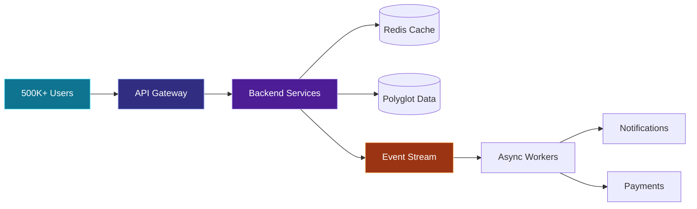

<div align="center">


# Jatin Singh

### I build backend systems that stay fast when everything gets busy.

[](https://singhjatin.dev/)
[](mailto:singh.jatin321@gmail.com)


</div>

<br />

<table>
<tr>
<td align="center" width="25%">
<h2>500K+</h2>
<sub>MONTHLY ACTIVE USERS</sub>
</td>
<td align="center" width="25%">
<h2>10K+</h2>
<sub>EVENTS PER SECOND</sub>
</td>
<td align="center" width="25%">
<h2>&lt;200ms</h2>
<sub>P95 API LATENCY</sub>
</td>
<td align="center" width="25%">
<h2>99.9%</h2>
<sub>PRODUCTION UPTIME</sub>
</td>
</tr>
</table>

## `$ whoami`

```typescript
const jatin = {
  role: "Associate Tech Lead",
  experience: "8+ years",
  superpower: "Turning complex requirements into reliable systems",
  domains: ["Fintech", "CRM", "Marketplaces", "Super Apps"],
  currentlyExploring: ["Distributed Systems", "Event-Driven Architecture"],
};
```

## The Systems I Enjoy Building



<div align="center">

### My Engineering Toolkit


</div>

## Selected System Stories

<details open>
<summary><b>Fintech Super App · 500K+ monthly active users</b></summary>
<br />

Built backend systems for real-time location, notifications, and payment services.

`Node.js` `TypeScript` `Express` `Kafka` `MongoDB`

> **Impact:** Kept peak API latency below 200ms P95, sustained 99.9% uptime, and enabled zero-downtime deployments.
</details>

<details>
<summary><b>Multi-Tenant CRM · 50+ isolated tenants</b></summary>
<br />

Designed campaign, segmentation, automation, SMS, and email workflows with strong tenant isolation.

`NestJS` `PostgreSQL` `MySQL` `Azure Event Hubs` `Redis`

> **Impact:** Doubled campaign delivery throughput and reduced database load and sync-related support tickets by 30–50%.
</details>

<details>
<summary><b>Microservices Fashion Platform · 3x faster discovery</b></summary>
<br />

Built gRPC-based services with polyglot persistence and secure presigned uploads.

`Node.js` `TypeScript` `gRPC` `PostgreSQL` `MongoDB` `Redis`

> **Impact:** Achieved sub-300ms P99 latency and improved catalog and search performance by 3x.
</details>

<details>
<summary><b>Payment & Government Integrations · Zero discrepancies</b></summary>
<br />

Delivered high-integrity bill payment flows with policy, limit, and eligibility enforcement.

`NestJS` `TypeORM` `Oracle DB` `gRPC`

> **Impact:** Shipped with zero production payment discrepancies and sub-second eligibility checks.
</details>

## GitHub Pulse

<!-- Replace every Dev-JatinSingh below with your GitHub username. -->
<div align="center">

<picture>
  <source media="(prefers-color-scheme: dark)" srcset="https://github-readme-stats.vercel.app/api?username=Dev-JatinSingh&show_icons=true&hide_border=true&theme=tokyonight&bg_color=00000000" />
  
</picture>
<picture>
  <source media="(prefers-color-scheme: dark)" srcset="https://github-readme-streak-stats.herokuapp.com/?user=Dev-JatinSingh&hide_border=true&theme=tokyonight&background=00000000" />
  
</picture>

<picture>
  <source media="(prefers-color-scheme: dark)" srcset="https://github-readme-activity-graph.vercel.app/graph?username=Dev-JatinSingh&theme=tokyo-night&hide_border=true&bg_color=00000000" />
  
</picture>

</div>

---

<div align="center">

### Have a difficult scaling problem?

I enjoy the ones that require a whiteboard, careful trade-offs, and good observability.

[](mailto:singh.jatin321@gmail.com)

<sub>Designed around measurable engineering impact, not badge collecting.</sub>

</div>
